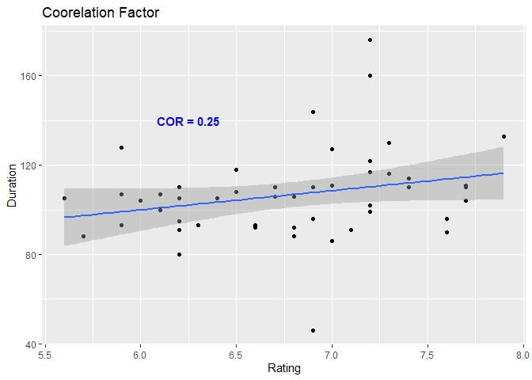

Movies_Webscrape
================
Brian Hudson
2022-11-14

# Introduction

I’m a car hobbyist who has a history with fixing, modifying, and running
cars on various tracks and obstacles. I’ve decided to scrape the top 50
car movies of all time on IMDB, clean the data and figure out some
statistical facts about the movies listed.

# Business Objective

Summarize the data and find out if there is a correlation between the
rating and time duration of the movies.

# Setting up Environment

Loading the Library. We will require `rvest` for html scraping, `dplyr`
for data manipulation, and `ggplot2` for visuals.

``` r
lapply(c('rvest', 'dplyr', 'ggplot2'), require, character.only = T)
```

    ## Loading required package: rvest

    ## Warning: package 'rvest' was built under R version 4.2.2

    ## Loading required package: dplyr

    ## Warning: package 'dplyr' was built under R version 4.2.2

    ## 
    ## Attaching package: 'dplyr'

    ## The following objects are masked from 'package:stats':
    ## 
    ##     filter, lag

    ## The following objects are masked from 'package:base':
    ## 
    ##     intersect, setdiff, setequal, union

    ## Loading required package: ggplot2

    ## [[1]]
    ## [1] TRUE
    ## 
    ## [[2]]
    ## [1] TRUE
    ## 
    ## [[3]]
    ## [1] TRUE

# Prepare the Data

``` r
link = "https://www.imdb.com/list/ls000071573/?sort=moviemeter,asc&st_dt=&mode=detail&page=1"
page = read_html(link)
```

#### Establish X Path to html variables to scrape

``` r
name = page %>% html_nodes(".lister-item-header a") %>% html_text()
year = page %>% html_nodes(".text-muted.unbold")%>% html_text()
rating = page %>% html_nodes(".ipl-rating-star.small .ipl-rating-star__rating")%>% html_text()
duration = page %>% html_nodes(".runtime")%>% html_text()
```

#### Look at the structure of the variables

``` r
str(duration)
```

    ##  chr [1:49] "117 min" "106 min" "46 min" "133 min" "110 min" "127 min" ...

``` r
str(name)
```

    ##  chr [1:50] "Cars" "The Fast and the Furious" "Knight Rider" ...

``` r
str(rating)
```

    ##  chr [1:50] "7.2" "6.8" "6.9" "7.9" "7.7" "7" "6.8" "7.4" "7.3" "7" "7.7" ...

``` r
str(year)
```

    ##  chr [1:53] "IMDb user rating (average)" "Number of votes" ...

# Process Data

Now we will clean the data <br> <br>

#### Extract the numbers from the duration data and convert to numeric while removing from list

``` r
duration <- regmatches(duration, gregexpr("[[:digit:]]+", duration))
duration <- as.numeric(unlist(duration))
str(duration)
```

    ##  num [1:49] 117 106 46 133 110 127 88 110 116 111 ...

#### Missing the 50th value, we will add it manually

``` r
duration[50] <-  110

print(duration)
```

    ##  [1] 117 106  46 133 110 127  88 110 116 111 111 122 107 104 110  96  96 118 114
    ## [20] 130 104  92  95 107 144  90 105 116 110 128  93  99  99  80  91 105  86  91
    ## [39]  93 160 100 108 102 176 106  93  92 105  88 110

#### Change rating to a number value

``` r
rating <- as.numeric(rating)
is.numeric(rating)
```

    ## [1] TRUE

#### To reduce code, I will check the formatting and use the edit function to create standarized formatting

``` r
print(year)
```

    ##  [1] "IMDb user rating (average)" "Number of votes"           
    ##  [3] "Release year or range"      "(2006)"                    
    ##  [5] "(2001)"                     "(1982–1986)"               
    ##  [7] "(1980)"                     "(1964)"                    
    ##  [9] "(2007)"                     "(1979)"                    
    ## [11] "(1973)"                     "(1994)"                    
    ## [13] "(2003)"                     "(1967)"                    
    ## [15] "(1998)"                     "(2003)"                    
    ## [17] "(2006)"                     "(1983)"                    
    ## [19] "(1977)"                     "(1981)"                    
    ## [21] "(2000)"                     "(1968)"                    
    ## [23] "(2011)"                     "(1971)"                    
    ## [25] "(2002)"                     "(1981)"                    
    ## [27] "(1990)"                     "(1968)"                    
    ## [29] "(1971 TV Movie)"            "(2008)"                    
    ## [31] "(1985)"                     "(1988)"                    
    ## [33] "(1984)"                     "(1986)"                    
    ## [35] "(1971)"                     "(1969)"                    
    ## [37] "(1975)"                     "(1978)"                    
    ## [39] "(1978)"                     "(I) (1998)"                
    ## [41] "(1980)"                     "(1999)"                    
    ## [43] "(1965)"                     "(I) (2012)"                
    ## [45] "(1968)"                     "(1971)"                    
    ## [47] "(1966)"                     "(1971)"                    
    ## [49] "(1974)"                     "(1958)"                    
    ## [51] "(1976)"                     "(1974)"                    
    ## [53] "(2009– )"

``` r
year <- edit(year)
print(year)
```

    ##  [1] "(2006)" "(2001)" "(1982)" "(1980)" "(1964)" "(2007)" "(1979)" "(1973)"
    ##  [9] "(1994)" "(2003)" "(1967)" "(1998)" "(2003)" "(2006)" "(1983)" "(1977)"
    ## [17] "(1981)" "(2000)" "(1968)" "(2011)" "(1971)" "(2002)" "(1981)" "(1990)"
    ## [25] "(1968)" "(1971)" "(2008)" "(1985)" "(1988)" "(1984)" "(1986)" "(1971)"
    ## [33] "(1969)" "(1975)" "(1978)" "(1978)" "(1998)" "(1980)" "(1999)" "(1965)"
    ## [41] "(2012)" "(1968)" "(1971)" "(1966)" "(1971)" "(1974)" "(1958)" "(1976)"
    ## [49] "(1974)" "(2009)"

#### Time to create a data frame since there are only 50 variables

``` r
car_movies <- data.frame(name,year,rating,duration, stringsAsFactors = F)
print(car_movies)
```

    ##                                     name   year rating duration
    ## 1                                   Cars (2006)    7.2      117
    ## 2               The Fast and the Furious (2001)    6.8      106
    ## 3                           Knight Rider (1982)    6.9       46
    ## 4                     The Blues Brothers (1980)    7.9      133
    ## 5                             Goldfinger (1964)    7.7      110
    ## 6                            Death Proof (2007)    7.0      127
    ## 7                                Mad Max (1979)    6.8       88
    ## 8                      American Graffiti (1973)    7.4      110
    ## 9                                  Speed (1994)    7.3      116
    ## 10                       The Italian Job (2003)    7.0      111
    ## 11                      Bonnie and Clyde (1967)    7.7      111
    ## 12                                 Ronin (1998)    7.2      122
    ## 13                      2 Fast 2 Furious (2003)    5.9      107
    ## 14 The Fast and the Furious: Tokyo Drift (2006)    6.0      104
    ## 15                             Christine (1983)    6.7      110
    ## 16                 Smokey and the Bandit (1977)    6.9       96
    ## 17                      The Road Warrior (1981)    7.6       96
    ## 18                    Gone in 60 Seconds (2000)    6.5      118
    ## 19                               Bullitt (1968)    7.4      114
    ## 20                             Fast Five (2011)    7.3      130
    ## 21                 The French Connection (1971)    7.7      104
    ## 22                       The Transporter (2002)    6.8       92
    ## 23                    The Cannonball Run (1981)    6.2       95
    ## 24                       Days of Thunder (1990)    6.1      107
    ## 25               Chitty Chitty Bang Bang (1968)    6.9      144
    ## 26                                  Duel (1971)    7.6       90
    ## 27                            Death Race (2008)    6.4      105
    ## 28               To Live and Die in L.A. (1985)    7.3      116
    ## 29         Tucker: The Man and His Dream (1988)    6.9      110
    ## 30                      Against All Odds (1984)    5.9      128
    ## 31                            The Wraith (1986)    5.9       93
    ## 32                       Vanishing Point (1971)    7.2       99
    ## 33                       The Italian Job (1969)    7.2       99
    ## 34                       Death Race 2000 (1975)    6.2       80
    ## 35                            The Driver (1978)    7.1       91
    ## 36                       Corvette Summer (1978)    5.6      105
    ## 37                                  Taxi (1998)    7.0       86
    ## 38                 The Hollywood Knights (1980)    6.2       91
    ## 39                           Blue Streak (1999)    6.3       93
    ## 40                        The Great Race (1965)    7.2      160
    ## 41                           Hit and Run (2012)    6.1      100
    ## 42                          The Love Bug (1968)    6.5      108
    ## 43                     Two-Lane Blacktop (1971)    7.2      102
    ## 44                            Grand Prix (1966)    7.2      176
    ## 45                               Le Mans (1971)    6.7      106
    ## 46                Dirty Mary Crazy Larry (1974)    6.6       93
    ## 47                          Thunder Road (1958)    6.6       92
    ## 48                     The Gumball Rally (1976)    6.2      105
    ## 49                    Herbie Rides Again (1974)    5.7       88
    ## 50                          Gumball 3000 (2009)    6.2      110

# Analyze Data

I will now acquire statistical facts about the movies list <br> <br>

#### Overall Summary

``` r
summary(car_movies)
```

    ##      name               year               rating         duration    
    ##  Length:50          Length:50          Min.   :5.600   Min.   : 46.0  
    ##  Class :character   Class :character   1st Qu.:6.225   1st Qu.: 93.5  
    ##  Mode  :character   Mode  :character   Median :6.900   Median :105.5  
    ##                                        Mean   :6.798   Mean   :106.8  
    ##                                        3rd Qu.:7.200   3rd Qu.:113.2  
    ##                                        Max.   :7.900   Max.   :176.0

#### Mean, Min, and Max

``` r
car_movies %>% 
  summarize(avg_rating = mean(rating),min_rating = min(rating), max_rating= max(rating))
```

    ##   avg_rating min_rating max_rating
    ## 1      6.798        5.6        7.9

``` r
car_movies %>% 
  summarize(avg_time = mean(duration), min_time = min(duration), max_time = max(duration))
```

    ##   avg_time min_time max_time
    ## 1    106.8       46      176

#### Compare the Ratings vs Duration to identify possible correlation

``` r
car_movies %>% group_by(year) %>% 
  arrange(-rating) %>% 
  print(n=50)
```

    ## # A tibble: 50 × 4
    ## # Groups:   year [37]
    ##    name                                  year   rating duration
    ##    <chr>                                 <chr>   <dbl>    <dbl>
    ##  1 The Blues Brothers                    (1980)    7.9      133
    ##  2 Goldfinger                            (1964)    7.7      110
    ##  3 Bonnie and Clyde                      (1967)    7.7      111
    ##  4 The French Connection                 (1971)    7.7      104
    ##  5 The Road Warrior                      (1981)    7.6       96
    ##  6 Duel                                  (1971)    7.6       90
    ##  7 American Graffiti                     (1973)    7.4      110
    ##  8 Bullitt                               (1968)    7.4      114
    ##  9 Speed                                 (1994)    7.3      116
    ## 10 Fast Five                             (2011)    7.3      130
    ## 11 To Live and Die in L.A.               (1985)    7.3      116
    ## 12 Cars                                  (2006)    7.2      117
    ## 13 Ronin                                 (1998)    7.2      122
    ## 14 Vanishing Point                       (1971)    7.2       99
    ## 15 The Italian Job                       (1969)    7.2       99
    ## 16 The Great Race                        (1965)    7.2      160
    ## 17 Two-Lane Blacktop                     (1971)    7.2      102
    ## 18 Grand Prix                            (1966)    7.2      176
    ## 19 The Driver                            (1978)    7.1       91
    ## 20 Death Proof                           (2007)    7        127
    ## 21 The Italian Job                       (2003)    7        111
    ## 22 Taxi                                  (1998)    7         86
    ## 23 Knight Rider                          (1982)    6.9       46
    ## 24 Smokey and the Bandit                 (1977)    6.9       96
    ## 25 Chitty Chitty Bang Bang               (1968)    6.9      144
    ## 26 Tucker: The Man and His Dream         (1988)    6.9      110
    ## 27 The Fast and the Furious              (2001)    6.8      106
    ## 28 Mad Max                               (1979)    6.8       88
    ## 29 The Transporter                       (2002)    6.8       92
    ## 30 Christine                             (1983)    6.7      110
    ## 31 Le Mans                               (1971)    6.7      106
    ## 32 Dirty Mary Crazy Larry                (1974)    6.6       93
    ## 33 Thunder Road                          (1958)    6.6       92
    ## 34 Gone in 60 Seconds                    (2000)    6.5      118
    ## 35 The Love Bug                          (1968)    6.5      108
    ## 36 Death Race                            (2008)    6.4      105
    ## 37 Blue Streak                           (1999)    6.3       93
    ## 38 The Cannonball Run                    (1981)    6.2       95
    ## 39 Death Race 2000                       (1975)    6.2       80
    ## 40 The Hollywood Knights                 (1980)    6.2       91
    ## 41 The Gumball Rally                     (1976)    6.2      105
    ## 42 Gumball 3000                          (2009)    6.2      110
    ## 43 Days of Thunder                       (1990)    6.1      107
    ## 44 Hit and Run                           (2012)    6.1      100
    ## 45 The Fast and the Furious: Tokyo Drift (2006)    6        104
    ## 46 2 Fast 2 Furious                      (2003)    5.9      107
    ## 47 Against All Odds                      (1984)    5.9      128
    ## 48 The Wraith                            (1986)    5.9       93
    ## 49 Herbie Rides Again                    (1974)    5.7       88
    ## 50 Corvette Summer                       (1978)    5.6      105

#### View the movies with an above average rating with below average duration

``` r
car_movies %>% 
  group_by(year) %>% 
  filter(rating > 6.7 & duration < 106)
```

    ## # A tibble: 12 × 4
    ## # Groups:   year [9]
    ##    name                  year   rating duration
    ##    <chr>                 <chr>   <dbl>    <dbl>
    ##  1 Knight Rider          (1982)    6.9       46
    ##  2 Mad Max               (1979)    6.8       88
    ##  3 Smokey and the Bandit (1977)    6.9       96
    ##  4 The Road Warrior      (1981)    7.6       96
    ##  5 The French Connection (1971)    7.7      104
    ##  6 The Transporter       (2002)    6.8       92
    ##  7 Duel                  (1971)    7.6       90
    ##  8 Vanishing Point       (1971)    7.2       99
    ##  9 The Italian Job       (1969)    7.2       99
    ## 10 The Driver            (1978)    7.1       91
    ## 11 Taxi                  (1998)    7         86
    ## 12 Two-Lane Blacktop     (1971)    7.2      102

#### View the movies with a below average rating with above average duration

``` r
car_movies %>% 
  group_by(year) %>% 
  filter(rating < 6.7 & duration < 106)
```

    ## # A tibble: 13 × 4
    ## # Groups:   year [12]
    ##    name                                  year   rating duration
    ##    <chr>                                 <chr>   <dbl>    <dbl>
    ##  1 The Fast and the Furious: Tokyo Drift (2006)    6        104
    ##  2 The Cannonball Run                    (1981)    6.2       95
    ##  3 Death Race                            (2008)    6.4      105
    ##  4 The Wraith                            (1986)    5.9       93
    ##  5 Death Race 2000                       (1975)    6.2       80
    ##  6 Corvette Summer                       (1978)    5.6      105
    ##  7 The Hollywood Knights                 (1980)    6.2       91
    ##  8 Blue Streak                           (1999)    6.3       93
    ##  9 Hit and Run                           (2012)    6.1      100
    ## 10 Dirty Mary Crazy Larry                (1974)    6.6       93
    ## 11 Thunder Road                          (1958)    6.6       92
    ## 12 The Gumball Rally                     (1976)    6.2      105
    ## 13 Herbie Rides Again                    (1974)    5.7       88

After viewing the data above, there appears to be little correlation
between the two sets of variables. Below we will find out the actual
correlation coefficient.  
<br> <br>

#### Calculate actual COR with pearson method

``` r
cor_f <- round(cor(car_movies$duration, car_movies$rating),2)
cor_f
```

    ## [1] 0.25

We can conclude that there is little correlation between duration and
rating of a movie <br> <br>

# Share Data

<br>

#### Below is a line plot to show the correlation between duration and rating

``` r
car_movies %>% 
  ggplot(aes(x = rating, y = duration)) +
  geom_point() + geom_smooth(method = lm) +
  labs(title = "Coorelation Factor", x = 'Rating', y = 'Duration') +
  annotate('text', 6.25, 140, label = paste("COR =", cor_f), fontface = 'bold', color = 'blue')
```

    ## `geom_smooth()` using formula 'y ~ x'

<!-- --> <br>

# Conclusion

<br>

- Ratings range from 5.6 to 7.9 with a **mean of 6.79**
- Duration range from 46 to 179 minutes **with a mean of 106.8**
- There is **little** correlation between **duration** and **rating**

We can conclude from the data that a higher rating is not affected by
the movie’s length but is rather subject to many variables, such as the
viewers background and opinion, content, acting quality, plot line, etc.
More testing would be needed to find the exact cause.
